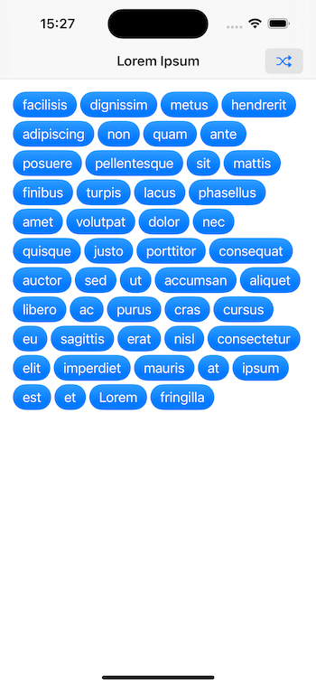
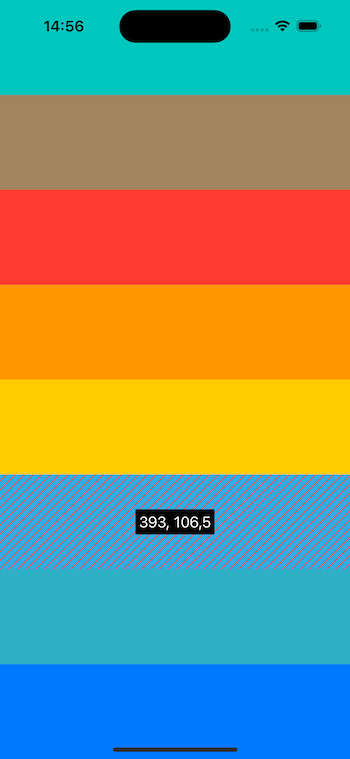

# SwiftUI extensions

A collection of SwiftUI convenient extensions and reusable custom views.

### Basic alert

Convenient alert view modifier using an identifiable error type and displaying the localized error message.

```swift
struct ContentView: View {
  @State private var error: SomeError?
  
  var body: some View {
    ScrollView {
      //...
    }
    .basicAlert(error: $error)
  }
}
```

### Loading button

SwiftUI button that handles async work and cancellation.

```swift
LoadingButton("Upload", systemImage: "arrow.up") {
  /// Tap to perform async work 
  /// or tap again to cancel the task.
}
```

### Flow stack

`FlowStack` is similar to `VStack` and `HStack` layouts, but wrapping the content vertically when there is no space left horizontally. 

```swift
ScrollView {
  FlowStack {
    ForEach(items, id: \.self) { item in
      TagView(item)
    }
  }
  .padding()
}
```


### Share sheet

`SwiftUI` sheet based on `UIKit` `UIActivityViewController`.

```swift
struct SomeView: View {
  @State private var isSheetPresented = false
  
  var body: some View {
    ScrollView {
      //...
    }
    .shareSheet(isPresented: $isSheetPresented, items: [product.url])
  }
}
```

### Toggle style: checkmark

```swift
Toggle("Show more options", isOn: $showMore)
  .toggleStyle(.checkCircle)
```

### Stretching header

```swift
StretchingHeader {
  Image(.landscape)
    .resizable()
    .scaledToFill()
  Text("Photo credits: Marcus Lee")
    .font(.caption)
}
```

### Lorem Ipsum text generator

```swift
guard let lipsum = String.loremIpsum(words: 20) else { return }
let words = lipsum.uniqueStrings()
```

### Navigation stack

```swift
SettingsView()
  .navigationStack()
  .navigationBar(
    backgroundColor: .systemTeal,
    foregroundColor: .white,
    backSystemImage: "arrow.left",
    hideSeparator: true
  )
```

### Fill & stroke combined shape modifier

```swift
Circle().fill(.red, stroke: .yellow, lineWidth: 4)
```

### View size overlay

```swift
VStack {
  Rectangle().fill(.mint)
  Rectangle().fill(.brown)
  Rectangle().fill(.red)
  Rectangle().fill(.orange)
  Rectangle().fill(.yellow)
  Rectangle().fill(.cyan).overlaySize()
  Rectangle().fill(.teal)
  Rectangle().fill(.blue)
}
```


